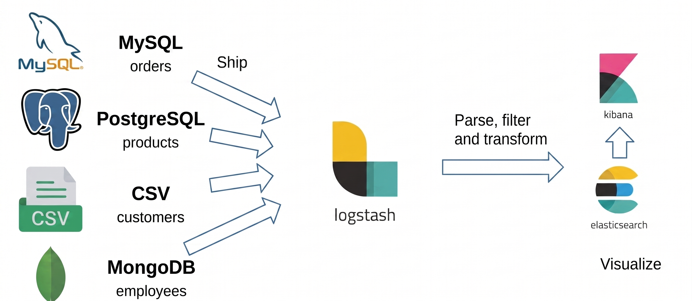

# Taller 2 — Flujo ELK en esquema Near Real-Time (Northwind)

**Curso:** MSDS 6012 Ingeniería de Datos — USFQ
**Instructor:** Juan Pablo Zaldumbide
**Autores:** Steeven Quezada - Máximo Pinta

## Objetivo

Diseñar e implementar un flujo de ingesta con el stack ELK (Elasticsearch, Logstash, Kibana) en esquema **near real-time**, integrando al menos 4 fuentes de datos de tipos distintos. Se implementó un esquema mixto: una fuente batch (CSV) y tres fuentes near real-time (MySQL, PostgreSQL y MongoDB), todas construidas sobre el dataset **Northwind**.

## Arquitectura



Cada fuente envía sus datos a Logstash, que los transforma (parseo, limpieza de campos, conversión de fechas) y los indexa en Elasticsearch. Kibana consulta Elasticsearch para construir el dashboard final.

> Coloca la imagen del diagrama en `docs/diagrama_arquitectura.png` para que se vea en este README.

## Fuentes de datos

| Fuente | Tabla / colección | Mecanismo de ingesta | Tipo de flujo | Índice en Elasticsearch |
|---|---|---|---|---|
| CSV | Customers | Input `file` (modo `read`) + filtro `csv` | Batch | `data_customers_csv` |
| MySQL | Orders | Input `jdbc` con polling incremental (`tracking_column`) | Near real-time | `data_orders_mysql` |
| PostgreSQL | Products | Input `jdbc` con polling incremental (`tracking_column`) | Near real-time | `data_products_postgres` |
| MongoDB | Employees | Script Python (pymongo) como puente, envío por socket TCP | Near real-time | `data_employees_mongo` |

MongoDB no cuenta con un plugin `jdbc` nativo confiable en Logstash, por lo que se construyó un puente propio: un script Python vigila la colección y reenvía los documentos nuevos a Logstash mediante un input `tcp` con codec `json_lines`.

## Estructura del repositorio

```
├── docs/
│   ├── diagrama_arquitectura.png            # diagrama de arquitectura
│   ├── Dashboard_Taller_2.png  # captura del dashboard final
│   └── Informe_Ejecutivo_Taller_ELK_Northwind.docx
├── drivers/
│   ├── mysql-connector-j-8.4.0.jar
│   └── postgresql-42.7.13.jar
├── logstash/
│   ├── customers_logstash.conf              # solución: CSV → Customers
│   ├── orders_logstash.conf                 # solución: MySQL → Orders
│   ├── products_logstash.conf               # solución: PostgreSQL → Products
│   ├── employees_logstash.conf              # solución: MongoDB → Employees
│   ├── mysql_logstash.conf                  # material de clase (referencia del profesor)
│   └── confport.conf                        # material de clase (referencia del profesor)
└── notebooks/
    ├── insertar_orders_mysql.ipynb          # simula pedidos nuevos en MySQL
    ├── insertar_products_postgres.ipynb     # simula productos nuevos en PostgreSQL
    ├── insertar_employees_mongo.ipynb       # simula empleados nuevos en MongoDB
    └── enviar_mongo_logstash.ipynb          # puente MongoDB → Logstash (TCP)
```

`mysql_logstash.conf` y `confport.conf` son el material original proporcionado en clase — se conservan como referencia para quien quiera comparar contra la solución final o replicar el ejercicio desde cero.

## Requisitos previos

- Docker (para correr MySQL, PostgreSQL, MongoDB, Elasticsearch, Kibana y Cerebro)
- [Logstash 7.17.10](https://www.elastic.co/downloads/past-releases/logstash-7-17-10) instalado localmente
- Python 3.x con:
  ```
  pip install mysql-connector-python psycopg2-binary pymongo jupyter
  ```
- El dataset Northwind cargado en cada motor:
  - MySQL (`northwind_mysql`, tabla `Orders`)
  - PostgreSQL (`northwind_pg`, tabla `products`)
  - MongoDB (`northwind_mongo`, colección `employees`)
  - Un CSV con la tabla `Customers`

## Cómo ejecutar

1. **Levantar las bases de datos y el stack ELK** (contenedores Docker de MySQL, PostgreSQL, MongoDB, Elasticsearch, Kibana y Cerebro).
2. **Copiar los archivos de `drivers/` y los `.conf` de `logstash/`** a la carpeta `bin/` de tu instalación de Logstash.
3. **Levantar Logstash** con cada `.conf`, en una terminal separada por fuente:
   ```
   logstash -f customers_logstash.conf
   logstash -f orders_logstash.conf
   logstash -f products_logstash.conf
   logstash -f employees_logstash.conf
   ```
4. **Correr los notebooks** de `notebooks/` para simular datos nuevos en vivo:
   - `insertar_orders_mysql.ipynb`, `insertar_products_postgres.ipynb`, `insertar_employees_mongo.ipynb`
   - Para MongoDB, corre también el puente: `enviar_mongo_logstash.ipynb`
5. **En Kibana** (`http://localhost:5601`), crea un index pattern por cada índice (`data_customers_csv`, `data_orders_mysql`, `data_products_postgres`, `data_employees_mongo`) y arma el dashboard combinando visualizaciones de las 4 fuentes.

## Resultados

El dashboard final combina paneles de las 4 fuentes: totales generales, distribución de clientes por país, precio promedio por categoría de producto, alerta de stock bajo, distribución de empleados por cargo, y un panel de series de tiempo que evidencia la ingesta near real-time de pedidos.

Ver captura en `docs/Dashboard_Taller_2.png` y el detalle completo en `docs/Informe_Ejecutivo_Taller_ELK_Northwind.docx`.

## Créditos

Material base del taller proporcionado por el profesor Juan Pablo Zaldumbide (MSDS 6012, USFQ). Solución, adaptación al dataset Northwind e implementación de las 4 fuentes por Steeven Quezada.